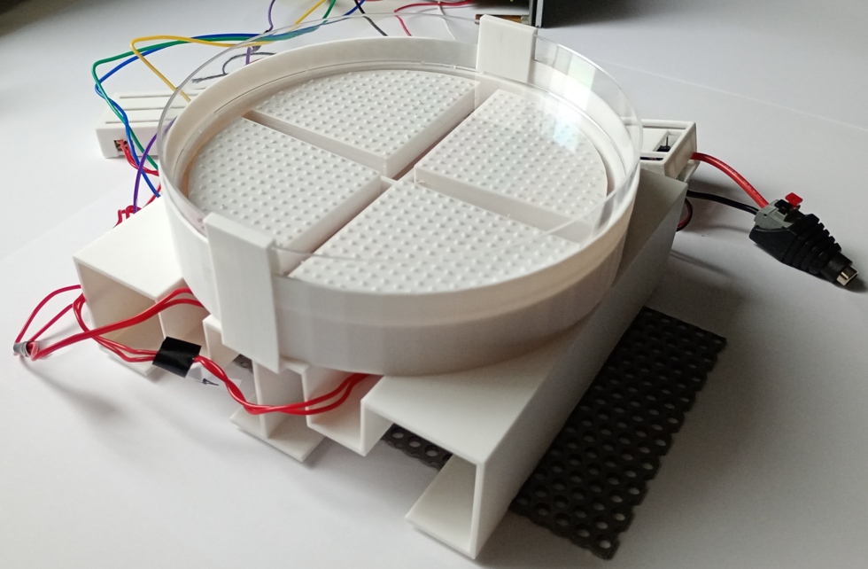
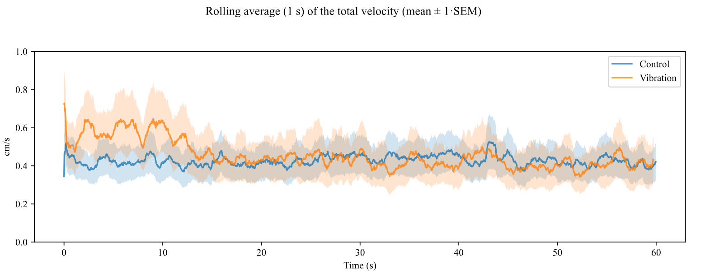
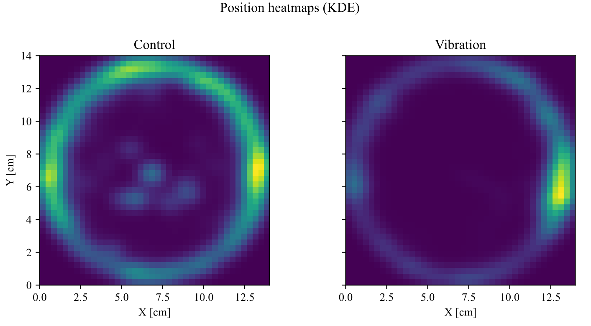

# The Quadrant Actuator Machine (QAM)
## Introduction
The Quadrant Actuator Machine (QAM) is an arena for experimental tests that consists of a removable Petri dish, four pull-type electromagnets and four quadrant-shaped hammers, separated by a margin and two walls to minimize vibration cross-talk. A PETG 3D-printed base holds the four electromagnets fitted with hammers. Another 3D-printed structure, (the crown holding the Petri dish), sits on top of it, held in place by a pair of 3D-printed grips. See the full documentation [here](The_Quadrant_Actuator_Machine.pdf).

  
  Picture of the final version of the Slim QAM.

The creation of the QAM was supported by the strategic programme Excellence Initiative at Jagiellonian University, Poland (RSM/122/FP).

## Programming

The I2C PWM board was programmed in Python to drive the solenoids as shown below. The quadrants are
denoted by *Qi* where *i* is any of the 4 available quadrants in the Petri dish and *Qi* ∈ {OFF, LOW, MEDIUM, HIGH}.

| Value | Description |
|----------|----------|
| OFF    | The electromagnet is not being acted upon.     |
| LOW    | The electromagnet taps the Petri dish 4 times per second.     |
| MEDIUM    | The electromagnet taps the Petri dish 8 times per second.     |
| HIGH    | The electromagnet taps the Petri dish 16 times per second.     |

The Python file `quadrant_operation.py` contains all the relevant code. To operate the PCA9685, the
following library has to be installed: `adafruit-circuitpython-pca9685`. For example, to activate only the
fourth quadrant at 4 taps/s, the script can be called like this:
`pi@raspberrypi:~/qam$ quadrant_operation.py LOW [0,0,0,1]`

## Example dataset obtained using the QAM

The QAM was tested by performing experiments on a model organism to gather data to extend the Vicsek
model (a swarm behavior model).

  
  Control vs Vibration setup on the QAM (speed).

  
  Control vs Vibration setup on the QAM (KDE heatmaps). Both leftmost quadrants were active
  in the Vibration group. Note the avoidance of the active quadrants.

